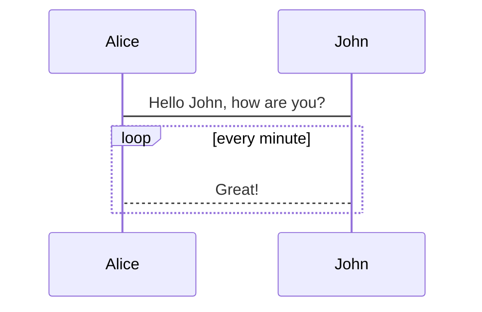

## 给站点添加标签显示

文章所有 “tags” 找办法显示在文章开头/右边 todo 2023年11月21日

## 集成 Mermaid

<https://vuepress-plugin-mermaidjs.efrane.com/>

### markdown语法形式

渲染前

````md

````

渲染后 （未生效）

::: tip
因为是通过components引入的mermaid，在`.vuepress/components/mermaid.vue`中未处理markdown语法的情况，所以未生效。 todo 使用 [vuepress-plugin-mermaidjs](https://github.com/eFrane/vuepress-plugin-mermaidjs) 引入 mermaid。
:::


### 组件形式

渲染前

```markdown
<mermaid>
{{`
graph TB
  id1(圆角矩形)--普通线-->id2[矩形];
  subgraph 子图
   id2==粗线==>id3{菱形}
   id3-.虚线.->id4>右向旗帜]
   id3--无箭头---id5((圆形))
  end
`}}
</mermaid>
```

渲染后

<mermaid>
{{`
graph TB
  id1(圆角矩形)--普通线-->id2[矩形];
  subgraph 子图
   id2==粗线==>id3{菱形}
   id3-.虚线.->id4>右向旗帜]
   id3--无箭头---id5((圆形))
  end
`}}
</mermaid>
