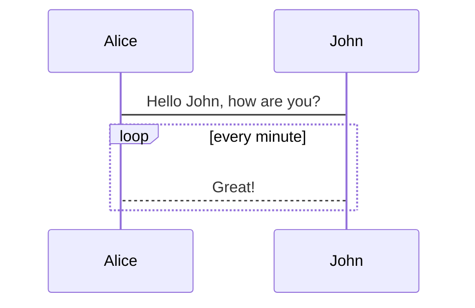

## 站点优化计划

### 给站点添加标签显示

文章所有 “tags” 找办法显示在文章开头/右边 todo 2023年11月21日

### 集成 Mermaid

<https://vuepress-plugin-mermaidjs.efrane.com/>

#### markdown语法形式

渲染前

````md

````

渲染后 （未生效）

::: tip
因为是通过components引入的mermaid，在`.vuepress/components/mermaid.vue`中未处理markdown语法的情况，所以未生效。 todo 使用 [vuepress-plugin-mermaidjs](https://github.com/eFrane/vuepress-plugin-mermaidjs) 引入 mermaid。
:::


#### 组件形式

渲染前

```markdown
<mermaid>
{{`
graph TB
  id1(圆角矩形)--普通线-->id2[矩形];
  subgraph 子图
   id2==粗线==>id3{菱形}
   id3-.虚线.->id4>右向旗帜]
   id3--无箭头---id5((圆形))
  end
`}}
</mermaid>
```

渲染后

<mermaid>
{{`
graph TB
  id1(圆角矩形)--普通线-->id2[矩形];
  subgraph 子图
   id2==粗线==>id3{菱形}
   id3-.虚线.->id4>右向旗帜]
   id3--无箭头---id5((圆形))
  end
`}}
</mermaid>

### 搜索结果优化

issue 搜索条件应该是交集，而不应该是并集 todo

e.g.

现在，搜索条件`python 使用笔记`得到的结果为`python`或者`使用笔记`其中一个匹配即可。

但我希望得到`python`和`使用笔记`的匹配结果！

想法： 可以用`python & 使用笔记`或者`python and 使用笔记`这样表示并集吗？

## genact - 装逼工具 “我很忙”

demo: <https://svenstaro.github.io/genact/>

genact 是一个无聊的活动生成器，它可以模拟各种看起来很忙或者很酷的命令行输出，让你在无聊的时候可以装作很忙或者很厉害。

命令： `genact -m docker_build`

使用`-m`选项来指定你想要运行的模块。 \
使用`-l`选项来查看所有可用的模块。

类似的工具：

+ `busygen`： 这是一个用Python编写的工具，它可以模拟`apt-get`和`yum`等命令，它是genact的灵感来源。
+ `hollywood`： 这是一个用Bash编写的工具，它可以模拟电影中的黑客场景，它可以在终端中显示多个窗口，每个窗口都有不同的动画效果。
+ `cool-retro-term`： 这是一个用`C++`和`QML`编写的工具，它可以模拟复古的终端，它可以让你的终端看起来像老式的电视或者计算机。
+ `cowsay`： 这是一个用`Perl`编写的工具，它可以让一头牛或者其他动物说出你输入的话，它可以让你的终端更有趣。
+ `fortune`： 这是一个用`C`编写的工具，它可以在终端中显示一些随机的名言或者笑话，它可以让你的终端更有智慧。
